# Lab7 php Dasar
## Nama : Wayis Al Qorni TS
## Nim : 312010169
## Kelas : TI.20.A.1
## Mata Kuliah: Pemrograman Web

### Install XAMPP 
Unduh XAMPP dari https://www.apachefriends.org/download.html dan pilih versi portable untuk memudahkan proses installasi. Kemudian extract file tersebut, sesuaikan direktorinya (misal: c:\xampp).

contoh gambar:

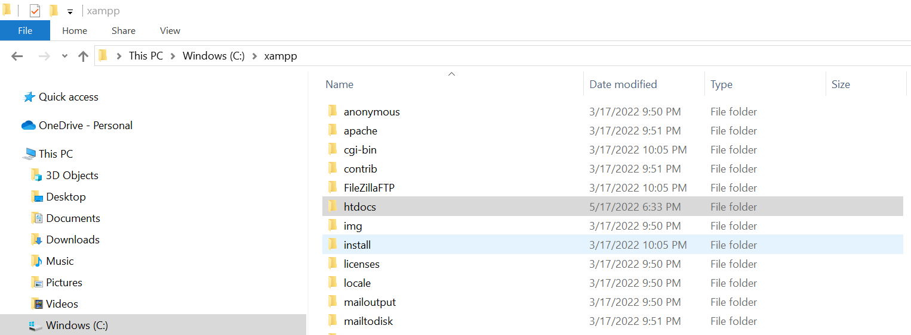

### Menjalankan Web Server 
Untuk menjalankan web server dari menu XAMPP Control. 

contoh gambar:

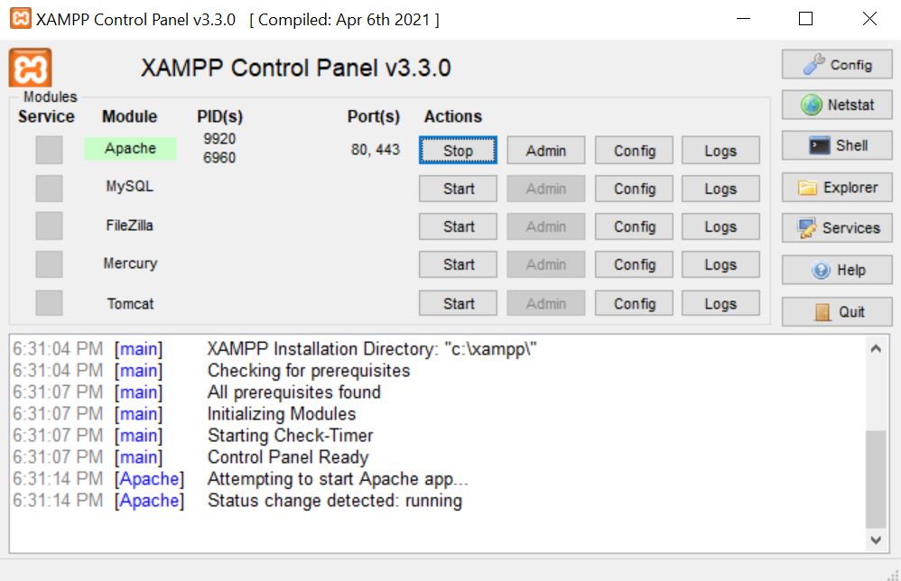

### Memulai PHP 
Buat folder lab7_php_dasar pada root directory web server (c:\xampp\htdocs)

contoh gambar:

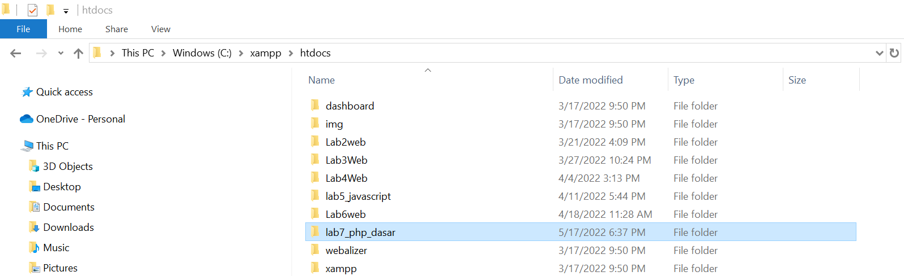

Kemudian untuk mengakses direktory tersebut pada web server dengan mengakses URL: http://localhost/lab7_php_dasar/  

contoh gambar:

 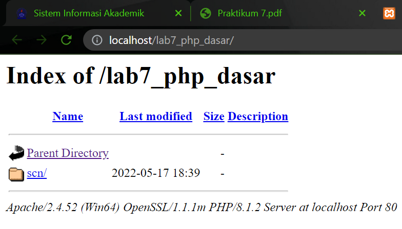

### PHP Dasar 
Buat file baru dengan nama php_dasar.php pada directory tersebut. Kemudian buat kode seperti berikut. 

```html
<!DOCTYPE html> 
<html lang="en"> 
<head>     
    <meta charset="UTF-8">     
    <title>PHP Dasar</title> 
</head> 
<body>     
    <h1>Belajar PHP Dasar</h1>     
    <?php         
    echo "Hello World";     
    ?> 
</body> 
</html>
```
Kemudian untuk mengakses hasilnya melalui URL: 
http://localhost/lab7_php_dasar/php_dasar.php 

contoh gambar:

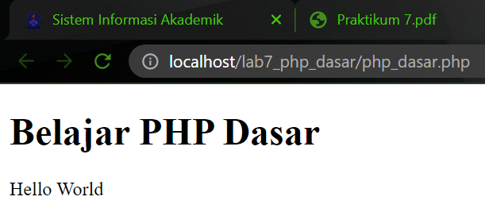

### Variable PHP 
Menambahkan variable pada program.

```html
<?php 
$nim = "0411500400"; 
$nama = 'Abdullah'; 
echo "NIM : " . $nim . "<br>"; 
echo "Nama : $nama"; 
?>
```

contoh gambar:

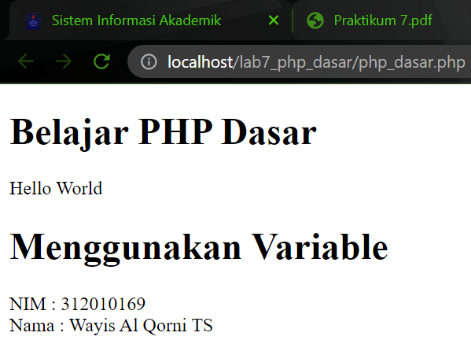

### Predefine Variable $_GET 

```html
<?php 
echo 'Selamat Datang ' . $_GET['nama']; 
?> 
```

Untuk mengaksesnya gunakan URL: http://localhost/lab7_php_dasar/latihan2.php?nama=Wayis

contoh gambar:

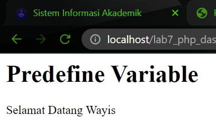

### Membuat Form Input 
Form di HTML dapat kita buat dengan tag `<form>`.

Tag ini memiliki beberapa atribut yang harus diberikan, seperti:

`action` untuk menentukan aksi yang akan dilakukan saat data dikirim;
`method` metode pengiriman data.

```html
<!DOCTYPE html> 
<html lang="en"> 
<head>     
    <meta charset="UTF-8">     
    <title>PHP Dasar</title> 
</head> 
<body> 
<h2>Form Input</h2> 
<form action="php_dasar.php" method="post">     
    <label>Nama: </label>     
    <input type="text" name="nama">     
    <input type="submit" value="Kirim"> 
</form>
<?php 
echo 'Selamat Datang ' . $_POST['nama']; 
?> 
</body> 
</html>
```

contoh gambar:

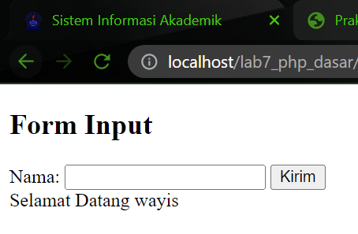

### Operator 
membuat operator pada program

```html
<?php 
$gaji = 1000000; 
$pajak = 0.1; 
$thp = $gaji - ($gaji*$pajak); 
echo "Gaji sebelum pajak = Rp. $gaji <br>"; 
echo "Gaji yang dibawa pulang = Rp. $thp"; 
?>
```

contoh gambar:

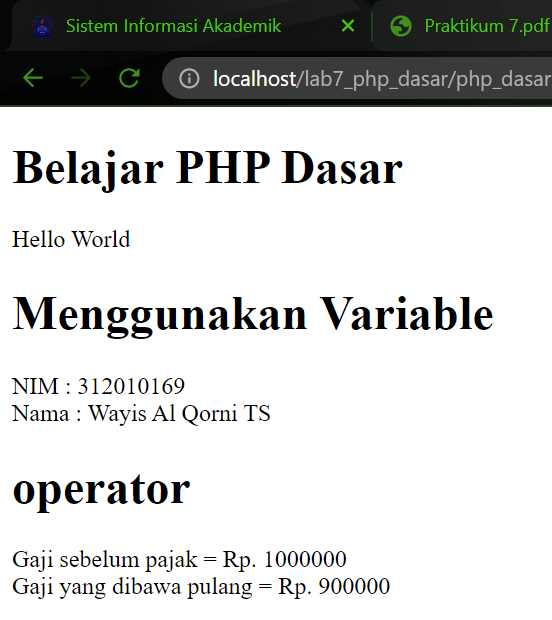

### Kondisi IF 
Pengambilan keputusan (kondisi if) digunakan untuk mengantisipasi kondisi yang terjadi saat jalanya program dan menentukan tindakan apa yang akan diambil sesuai dengan kondisi.

```html
<?php 
$nama_hari = date("l"); 
if ($nama_hari == "Sunday") {     
    echo "Minggu"; 
} elseif ($nama_hari == "Monday") {     
    echo "Senin"; 
} else {     
    echo "Selasa"; 
} 
?> 
```

contoh gambar:

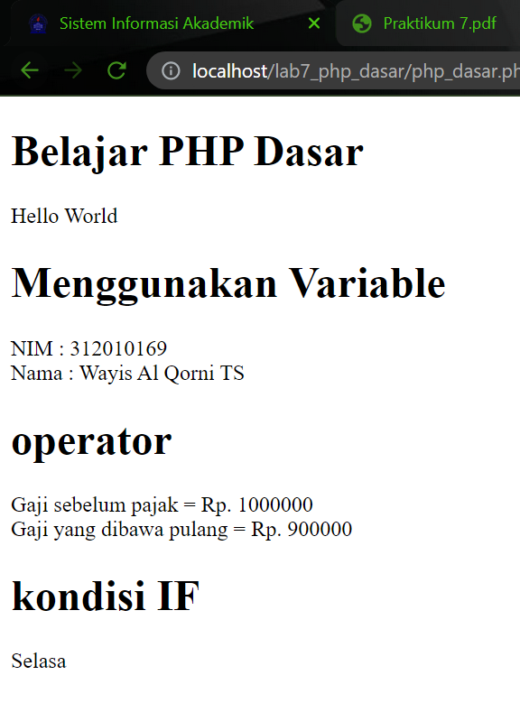

### Kondisi Switch 
Kondisi SWITCH CASE adalah percabangan kode program dimana kita membandingkan isi sebuah variabel dengan beberapa nilai. Jika proses perbandingan tersebut menghasilkan true, maka block kode program akan di proses.

kode:
```html
<?php 
$nama_hari = date("l"); 
switch ($nama_hari) {     
    case "Sunday":         
        echo "Minggu";         
        break;     
    case "Monday":         
        echo "Senin";         
        break; 
    case "Tuesday":         
        echo "Selasa";         
        break;     
    default:         
        echo "Sabtu"; 
?> 
```

contoh gambar:

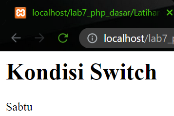

### Perulangan for 
Pengulangan for biasanya menggunakan suatu variabel untuk mengendalikan berapa kali tubuh loop akan dieksekusi dan menentukan kapan loop akan berhenti.

kode:
```html
<?php 
echo "Perulangan 1 sampai 10 <br />"; 
for ($i=1; $i<=10; $i++) {     
    echo "Perulangan ke: " . $i . '<br />'; 
} 
 
echo "Perulangan Menurun dari 10 ke 1 <br />"; 
for ($i=10; $i>=1; $i--) {     
    echo "Perulangan ke: " . $i . '<br />'; 
} 
?> 
```

contoh gambar:

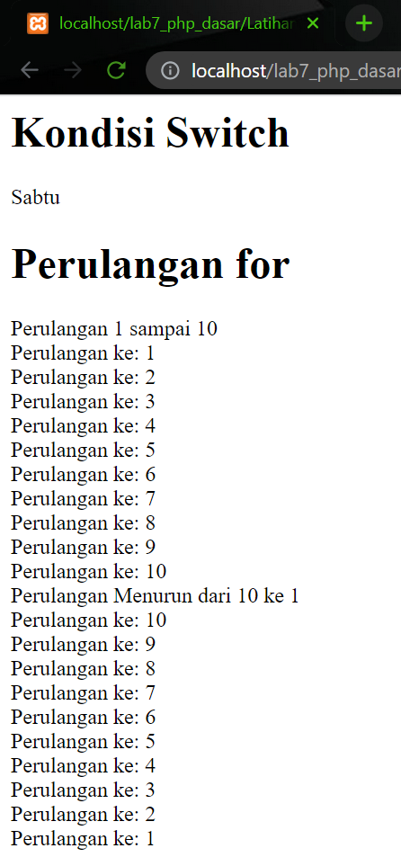

### Perulangan while 
perulangan while adalah perulangan yang bersifat indefinite alias tidak pasti, atau bahkan tidak terbatas. Sebuah blok kode akan dilakukan terus-menerus selama suatu kondisi terpenuhi. Jika suatu kondisi ternyata tidak terpenuhi pada iterasi ke 10, maka perulangan akan berhenti.

kode:
```html
<?php 
echo "Perulangan 1 sampai 10 <br />"; 
$i=1; 
while ($i<=10) {     
    echo "Perulangan ke: " . $i . '<br />';     
    $i++; 
} 
?>
``` 

contoh gambar:

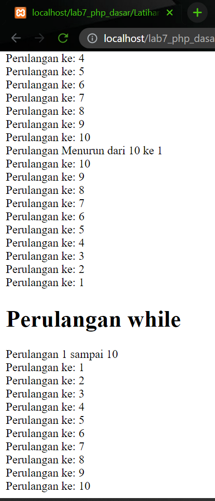

### Perulangan dowhile 
Perulangan DO WHILE merupakan modifikasi dari perulangan WHILE, yakni dengan memindahkan posisi pemeriksaan kondisi ke akhir perulangan. Artinya, lakukan dahulu sebuah perulangan, baru periksa apakah kondisi variabel counter sudah terpenuhi atau belum di akhir perulangan.

kode:
```html
<?php 
echo "Perulangan 1 sampai 10 <br />"; 
$i=1; 
do {     
    echo "Perulangan ke: " . $i . '<br />';     
    $i++; 
} while ($i<=10); 
?>
```

contoh gambar:

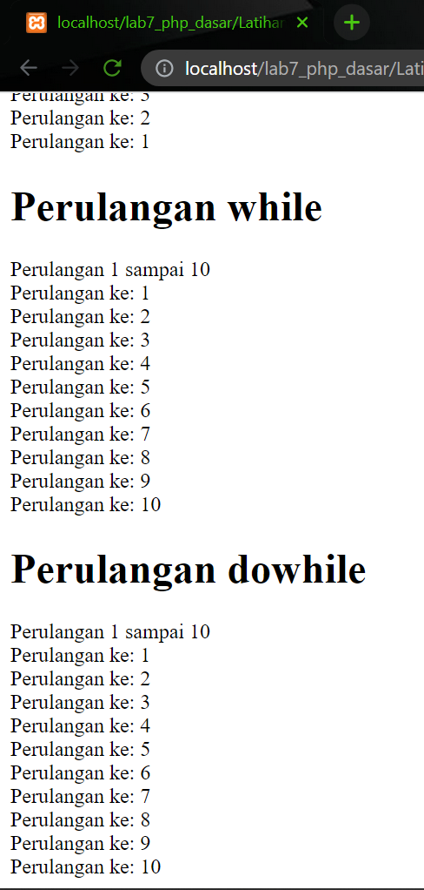